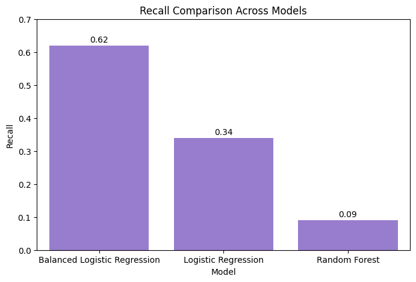
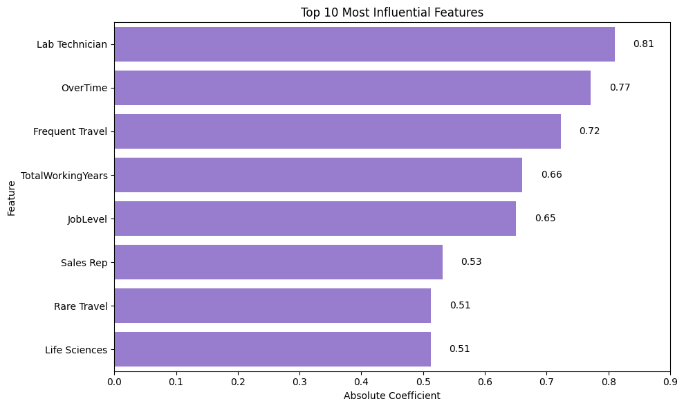

# Employee Attrition Prediction and Retention Analysis

End-to-end HR analytics project focused on employee attrition prediction, retention analysis, feature importance evaluation, and business recommendations using machine learning models.

---

## Project Highlights

### Model Comparison



### Feature Importance



---

## Project Overview

Employee attrition is a major challenge for organizations because employee turnover leads to increased recruitment costs, productivity loss, and knowledge gaps.

This project aims to identify employees who are at risk of leaving the company and provide data-driven retention recommendations using machine learning techniques.

The analysis combines exploratory data analysis (EDA), feature engineering, classification modeling, model comparison, and business-oriented interpretation of results.

---

## Business Problem

The primary objective is to predict employee attrition and understand the factors that contribute to employee turnover.

Key questions addressed in this project include:

- Which employees are most likely to leave the company?
- What workplace factors influence attrition?
- How do work-life balance and compensation affect retention?
- Which machine learning model performs best for identifying at-risk employees?

---

## Dataset

The project uses the IBM HR Analytics Employee Attrition dataset.

Dataset includes employee information such as:

- Demographics
- Education
- Job Role
- Business Travel Frequency
- Overtime
- Monthly Income
- Job Satisfaction
- Environment Satisfaction
- Work-Life Balance
- Years at Company
- Promotion History

### Target Variable

- Attrition
  - Yes = Employee left the company
  - No = Employee stayed

---

## Exploratory Data Analysis

The following analyses were performed:

- Demographic Analysis
- Work-Life Analysis
- Compensation Analysis
- Job Satisfaction Analysis
- Feature Relationship Analysis
- High-Income & High-Satisfaction Employee Analysis

### Key Findings

- Employees working overtime showed significantly higher attrition rates.
- Frequent business travel was associated with increased turnover.
- Certain job roles experienced much higher attrition than others.
- Employees with longer total working experience were generally less likely to leave.

---

## Data Preprocessing

The following preprocessing steps were applied:

- Target variable encoding
- Removal of non-informative variables
- One-hot encoding
- Train-Test Split (80/20)
- Feature Scaling using StandardScaler

---

## Machine Learning Models

### Logistic Regression

Baseline classification model used for initial performance evaluation.

### Balanced Logistic Regression

Implemented using:

```python
class_weight="balanced"
```

to address class imbalance and improve employee attrition detection.

### Random Forest

Tree-based ensemble model used to capture nonlinear relationships.

---

## Model Comparison

| Model | Accuracy | Recall | ROC-AUC |
|---------|---------|---------|---------|
| Logistic Regression | 0.86 | 0.34 | 0.80 |
| Balanced Logistic Regression | 0.75 | 0.62 | 0.80 |
| Random Forest | 0.83 | 0.09 | 0.80 |

### Selected Model

Balanced Logistic Regression was selected as the preferred model.

Although Logistic Regression achieved the highest accuracy, Balanced Logistic Regression achieved the highest recall score for attrition cases.

Since the primary business objective is identifying employees at risk of leaving, recall was prioritized over accuracy.

---

## Feature Importance

The most influential predictors of employee attrition were:

- Laboratory Technician
- Overtime
- Frequent Business Travel
- Sales Representative
- Job Level
- Total Working Years
- Years Since Last Promotion

These findings suggest that workload, travel requirements, career stage, and job characteristics play a significant role in employee retention.

---

## Business Recommendations

1. Reduce excessive overtime whenever possible.
2. Monitor employees with frequent business travel.
3. Develop retention strategies for high-risk job roles.
4. Create clearer promotion pathways.
5. Improve career development opportunities.
6. Track employee satisfaction indicators regularly.

---

## Technologies Used

- Python
- Pandas
- NumPy
- Seaborn
- Matplotlib
- Scikit-learn
- Jupyter Notebook

---

## Repository Structure

```text
employee-attrition-prediction/
│
├── employee_attrition.ipynb
├── Employee_Attrition_Analysis.csv
├── feature_importance.png
├── model_comparison.png
└── README.md
```

---

## Author

**Yağmur Ozar**

Statistics Graduate | Data Analytics & Machine Learning
