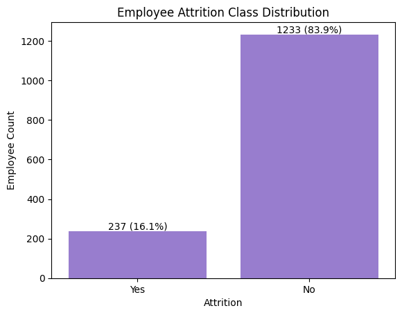
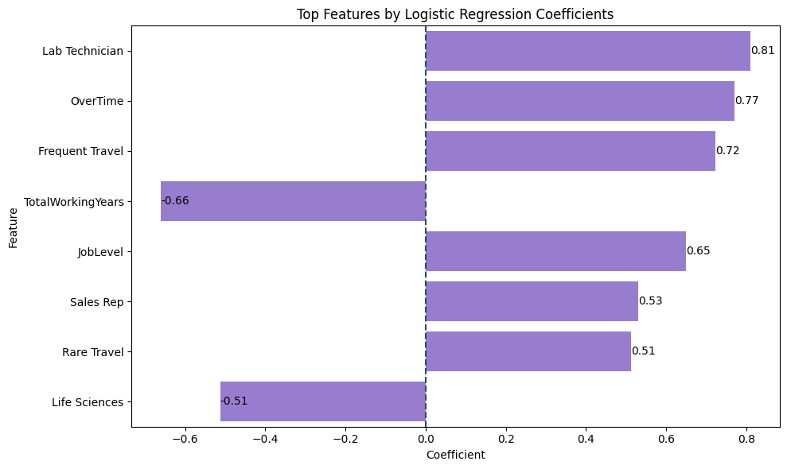

# Employee Attrition Prediction and Retention Analysis

An end-to-end HR Analytics project that leverages machine learning to predict employee attrition, identify the key drivers of turnover, and provide actionable retention recommendations for HR decision-making.

---

## Project Overview

## Project Overview

Employee attrition creates significant organizational costs through recruitment expenses, productivity loss, and the erosion of institutional knowledge. This project leverages the IBM HR Analytics Dataset to predict employee attrition, identify the key drivers of turnover, and provide actionable retention recommendations.

The workflow includes exploratory data analysis (EDA), feature engineering, classification modeling, model evaluation, and business-focused interpretation of results. By identifying high-risk employee profiles before potential resignation, the project aims to support proactive HR decision-making and improve talent retention strategies.

---

## Business Problem

The primary objective is to predict employee attrition and understand the factors that contribute to employee turnover.

Key questions addressed in this project include:

- Which employees are most likely to leave the company?
- What workplace factors have the greatest impact on attrition?
- Which machine learning model performs best in predicting employee attrition?
- Which machine learning model performs best for identifying at-risk employees?
- What actionable insights can HR teams use to improve retention?

---

## Dataset

The project uses the IBM HR Analytics Employee Attrition Dataset, which contains 1,470 employee records and 35 features related to demographics, compensation, job characteristics, and workplace satisfaction.

### Feature Categories

- **Demographics:** Age, Gender, Marital Status, Education Field
- **Compensation & Career:** Monthly Income, Job Level, Stock Option Level, Percent Salary Hike
- **Work Environment:** Overtime, Business Travel, Distance From Home, Job Involvement
- **Employee Satisfaction:** Job Satisfaction, Environment Satisfaction, Work-Life Balance
- **Tenure & Growth:** Years at Company, Years Since Last Promotion, Total Working Years

### Target Variable

- **Attrition**
  - **Yes:** Employee left the company
  - **No:** Employee stayed with the company

### Class Distribution



The target variable is imbalanced, with 83.9% of employees staying and 16.1% leaving the company.

---

## Exploratory Data Analysis

The following analyses were performed:

- Demographic Analysis
- Work-Life Analysis
- Compensation Analysis
- Job Satisfaction Analysis
- Feature Relationship Analysis
- High-Income & High-Satisfaction Employee Analysis

### Key Findings

- Employees working overtime showed significantly higher attrition rates.
- Frequent business travel was associated with increased turnover.
- Certain job roles experienced much higher attrition than others.
- Employees with longer total working experience were generally less likely to leave.

---

## Data Preprocessing

The following preprocessing steps were applied:

- Encoded the target variable (`Attrition`)
- Removed non-informative features
- Applied One-Hot Encoding to categorical variables
- Train-Test Split (80/20)
- Standardized numerical features using `StandardScaler`

---

## Machine Learning Models

---

## Model Performance & Comparison

Since the dataset is imbalanced, model evaluation focused primarily on **Recall** and **ROC-AUC** rather than accuracy alone. In an employee attrition problem, identifying employees at risk of leaving is more important than maximizing overall accuracy.


| Model | Accuracy | Recall | ROC-AUC |
|---------|---------|---------|---------|
| Balanced Logistic Regression | 0.75 | 0.62 | 0.80 |
| Random Forest | 0.83 | 0.09 | 0.80 |

### Selected Model

Balanced Logistic Regression was selected as the preferred model. Although Random Forest achieved higher accuracy, it identified only a small proportion of employees who actually left the company (Recall = 0.09). Since the primary business objective is identifying employees at risk of attrition, recall was prioritized over accuracy.

---

## Top Features by Logistic Regression Coefficients

The most influential predictors of employee attrition identified by the Balanced Logistic Regression model are shown below.




These findings suggest that workload, travel requirements, career stage, and job characteristics play a significant role in employee retention.

---

## Business Recommendations

Based on the analysis and model findings, the following actions may help reduce employee attrition:

1. **Reduce Excessive Overtime**
   - Monitor workloads and redistribute tasks to prevent employee burnout.
 2.**Support Frequent Business Travelers**
   - Provide flexible work arrangements and additional support for employees with high travel demands.
 3. **Create Clear Promotion Pathways**
   - Identify employees who have not received promotions for extended periods and establish transparent career progression plans.
4. **Strengthen Career Development Programs**
   - Offer training, mentoring, and internal mobility opportunities to improve employee engagement.
5. **Monitor Employee Satisfaction**
   - Regularly track job satisfaction, work-life balance, and workplace engagement metrics.
. **Focus on High-Risk Employee Groups**
   - Use predictive analytics to proactively identify and support employees at higher risk of attrition.

---

## Technologies Used

- Python
- Pandas
- NumPy
- Seaborn
- Matplotlib
- Scikit-learn
- Jupyter Notebook

---

## Repository Structure

```text
employee-attrition-prediction/
│
├── employee_attrition.ipynb
├── Employee_Attrition_Analysis.csv
├── class_imbalance.png
├── top_features.png
└── README.md
```

---

## Author

**Yağmur Ozar**

Statistics Graduate | Data Analytics & Machine Learning
